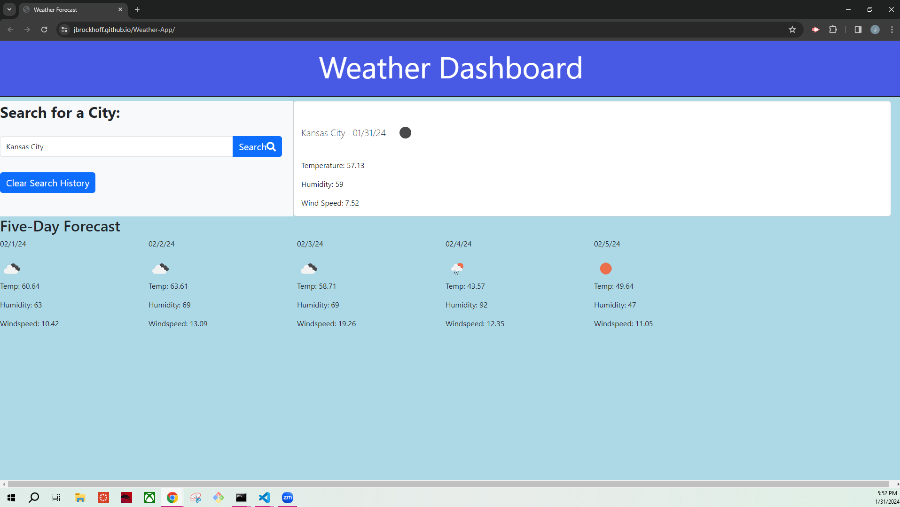

# Weather-App

## Description

This application will be used as a way for the user to input a specific location and receive a 5-day forecast for the given area.

## Usage
This app can be used to determine current weather conditions and a five-day weather forecast for the city input into the search bar.

Here is a screenshot of my deployed application:

Here is a link to my GitHub repo for this application:

https://github.com/Jbrockhoff/Weather-App

Here is a link to the deployed application:

https://jbrockhoff.github.io/Weather-App/

## Installation
N/A

## Credits
Resources:

http://w3school.com on jQuery

https://developer.mozilla.org/en-US/ on event listeners 

https://day.js.org/docs/en/display/format on date and time formatting

Tutoring assistance from Chris Baird

## License

MIT License

Copyright (c) [2024] [Jennie Brockhoff]

Permission is hereby granted, free of charge, to any person obtaining a copy
of this software and associated documentation files (the "Software"), to deal
in the Software without restriction, including without limitation the rights
to use, copy, modify, merge, publish, distribute, sublicense, and/or sell
copies of the Software, and to permit persons to whom the Software is
furnished to do so, subject to the following conditions:

The above copyright notice and this permission notice shall be included in all
copies or substantial portions of the Software.

THE SOFTWARE IS PROVIDED "AS IS", WITHOUT WARRANTY OF ANY KIND, EXPRESS OR
IMPLIED, INCLUDING BUT NOT LIMITED TO THE WARRANTIES OF MERCHANTABILITY,
FITNESS FOR A PARTICULAR PURPOSE AND NONINFRINGEMENT. IN NO EVENT SHALL THE
AUTHORS OR COPYRIGHT HOLDERS BE LIABLE FOR ANY CLAIM, DAMAGES OR OTHER
LIABILITY, WHETHER IN AN ACTION OF CONTRACT, TORT OR OTHERWISE, ARISING FROM,
OUT OF OR IN CONNECTION WITH THE SOFTWARE OR THE USE OR OTHER DEALINGS IN THE
SOFTWARE.

---
